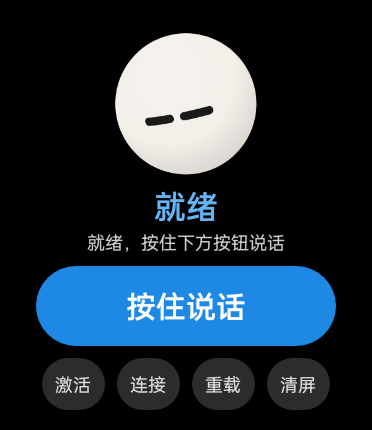
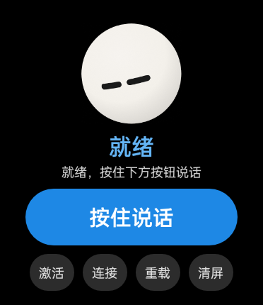
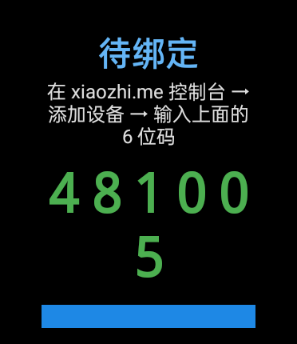

# 小智手表端 · Xiaozhi on OPPO Watch 2

把一块真正的安卓智能表（OPPO Watch 2 42mm / OWW202）变成小智 AI 的语音伙伴：**按住说话 → 云侧识别/思考/合成 → 表上播放，中间住着一颗会对你"共情回应"的表情球**。

纯客户端直连小智官方云（`wss://api.tenclass.net`），**零自建服务器、零 root、免 Gradle 单脚本构建**，APK 约 350KB。据我们所知，这是小智生态里第一个跑在安卓手表真机上的客户端。

| 单戳轻晃 | 连击被"rua"晕 | 激活绑定 |
|---|---|---|
|  |  |  |

## 亮点

- **共情回应表情球**（移植自 [NX_emotion-ball](https://github.com/sam70361/NX_emotion_ball)，40+1 种数据驱动表情）：球是对话的另一方而非复读机——你说"我生气了"，它低头耷眼**心疼**（50 安抚/51 同仇敌忾/52 悬心/53 凝噎按情绪细分），而不是跟着红脸。
- **按需连接**：待机不挂 WebSocket，按住说话当场建连（未就绪时按下自动排队，握手一到自动开麦，用户无感）；空闲 20s 主动断开、息屏立即收线、亮屏自动预连。官方云对未认领会话 ~65s 空闲回收的"断链闪烁 + 保活耗电"问题从根上消除。
- **抬手即说**：接管了 ColorOS 的**上键长按**广播（禁用小布后直接拉起小智并自动开麦 8s），也接管了表盘"小布"图标入口——手表形态的"全局快捷键"。
- **戳互动**：单点轻晃、连击递进（好奇→满意→被戳晕）、长按 rua 头（眯眼蹭头，久 rua 转安静陪伴）、AI 说话中戳球=打断；媒体通路合成音效（默认开）+ 真机马达分级震动 + 表情球目光跟随手腕倾角。
- **穿戴级工程账本**：32 位 armv7 纯 Java 全链路（Concentus Opus / Java-WebSocket，零 native）、`AudioSource.MIC` 与媒体播放通路的真机实测约束、Device-Id 大小写敏感等踩坑记录全部写在文档里（）。

## 硬件平台（实测约束）

| 项 | 值 |
|---|---|
| 屏幕 | **372×430 方屏（圆角矩形）** @320dpi —— 注意：不是圆屏，圆形的是表盘设计 |
| SoC/系统 | armv7 32 位 / ColorOS Watch（Android 8.1, API 27），RAM ~878MB |
| 麦克风 | 仅 `AudioSource.MIC` 可用（`VOICE_COMMUNICATION` 近乎聋） |
| 扬声器 | 仅 `USAGE_MEDIA` 通路有声；`AudioTrack` 只认 MODE_STREAM |
| 网络 | 默认经手机蓝牙代理（COMPANION_PROXY），上行 ~19kbps 够用 |
| 权限 | 无 root / 无 fastboot，仅 APK 侧载 |

## 功能状态

| 阶段 | 内容 | 状态 |
|---|---|---|
| P0 | 音频能力探针（录音/播放/Opus 压测） | ✅ `probe_audio/` |
| P1 | 按住说话端到端（WS 协议 + Opus + 激活流程） | ✅ 真机跑通 |
| P2 | 表情球 + 共情回应 + 待机氛围轮换 + 戳互动 | ✅ 真机验证 |
| — | 按需连接 / 抬手预连 / 震动音效 / 新表情管线 | ✅ 真机验证 |
| P3 | 唤醒词（sherpa-onnx KWS）/ 自动续听 / AEC 实时打断 | ⬜ 计划 |
| P4 | 手表传感器 MCP（心率/血氧/HRV/心情） | ⬜ 计划（生态独有卖点） |

## 快速开始

前置：Windows + [JDK 17](https://adoptium.net/) + Android build-tools 33（含 `aapt2/d8/zipalign/apksigner`）+ adb。不需要 Android Studio。

```powershell
# 1) 依赖 jar 放到 libs/（见 LICENSE 第 3 条的三个坐标）
# 2) 构建（脚本内工具链路径按你本机改）
powershell -NoProfile -ExecutionPolicy Bypass -File app\build.ps1
# 3) 安装并启动
adb install -r app\out\app.apk
adb shell am start -n com.xiaozhi.watch/.MainActivity
# 看日志
adb logcat -s XZW
```

首次启动会自造设备身份（随机 `02:` 本地管理位 MAC，**必须小写**——官方服务端大小写敏感），用 test-token 直连即可对话；想绑定自己的智能体：点表上「激活」取 6 位码，去 [xiaozhi.me](https://xiaozhi.me) 控制台输入即可。

### 调试小技巧

```bash
adb shell am start -n com.xiaozhi.watch/.MainActivity --ei talkms 4000 --ei loop 3  # 自动按住说话
adb shell am start -n com.xiaozhi.watch/.MainActivity --ei poke 6                   # 模拟连戳（互动自检）
adb shell am start -n com.xiaozhi.watch/.MainActivity --es emo loop                 # 表情循环演示
```

> 充电时 ColorOS 的充电覆盖窗会挡住截屏，验证以 `logcat`/`gfxinfo` 客观数据为准。

## 目录结构

```
app/                主客户端（纯 Java，无 Gradle，build.ps1 七步构建）
  src/com/xiaozhi/watch/
    XiaozhiClient    协议状态机 + 按需连接 + 音频管线
    MainActivity     UI/手势/氛围轮换/戳互动决策 + 传感器/触觉
    EmotionBallView  表情球渲染引擎（上游衍生，非商用，见 LICENSE）
    LocalEmotion     用户情绪识别 → 共情回应映射
    DeviceIdentity   自造设备身份（小写 MAC + UUID）
    OtaClient        官方激活/绑定流程
probe_audio/       P0 音频能力探针（独立小 App）
tools/             协议探针（ws_probe/ota_probe/raw_dump/stub_server）+ 表情生成管线
延伸阅读：`app/P1_RESULTS.md`（端到端实测）· `app/NEW_EMOTIONS.md`（表情设计与生成管线）· `app/POKE_INTERACTION.md`（戳互动）· `XIAOBU_TAKEOVER.md`（上键长按接管）· `probe_audio/`（P0 音频探针）
```

## 许可与免责（务必阅读）

- 本仓库自研代码 **MIT**；但**表情球相关代码衍生自 NX_emotion-ball，继承其"仅供学习交流、禁止商用"限制**——整体商用前请先读 [`LICENSE`](LICENSE) 第 2 条（也提供了"无表情球干净版"的移除指引）。
- 与小智官方无任何隶属关系；连接官方云仅作普通客户端使用，请遵守其服务条款并克制使用。仓库不含任何服务端部署、License 绕过或激活码滥用内容。
- 本仓库不携带任何 OPPO 固件/反编译产物；`references/`（上游素材与本机分析材料）已被 `.gitignore` 排除。

## 致谢

- [78/xiaozhi-esp32](https://github.com/78/xiaozhi-esp32) 与 [xiaozhi.me](https://xiaozhi.me) —— 协议与官方云；[78/xiaozhi-sf32](https://github.com/78/xiaozhi-sf32) 是最同构的手表级参照
- [sam70361/NX_emotion-ball](https://github.com/sam70361/NX_emotion_ball) —— 表情球上游
- [Concentus](https://github.com/opus-codec) / [Java-WebSocket](https://github.com/TooTallNate/Java-WebSocket) —— 纯 Java Opus 与 WS
- 社区客户端参照：[py-xiaozhi](https://github.com/huangjunsen0406/py-xiaozhi)、[xiaozhi-android-client](https://github.com/TOM88812/xiaozhi-android-client)、[xiaozhi-client](https://github.com/shenjingnan/xiaozhi-client)
